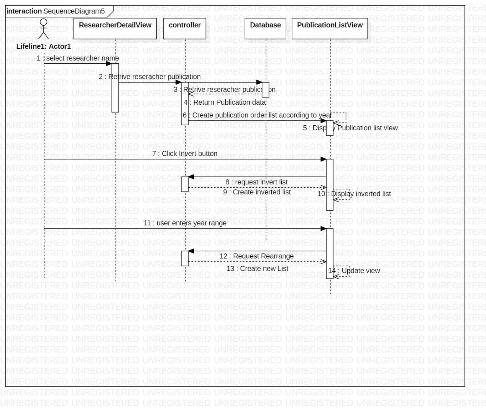

# Researcher_management_c_charp
comprehensive researcher management program with GUI. Implemented in C#. Users can see researchers' personal details and research records.
 

## Package Structure
 </br>

## Class Structure
 </br>

 </br>

 </br>

 </br>

## User Sequence Overview
 </br>

 </br>

## USE CASE
 </br>
User can filter the researchers by name and check their details including further details of their publication. </br>


## Need to configure database connecter
in [ERDAdapter.cs](database/ERDAdapter.cs) file [Line 20~23](database/ERDAdapter.cs#L20-23)
```
		//Connect to the database
        private const string db = "dbname";
        private const string user = "username";
        private const string pass = "passwd";
        private const string server = "server.ip.utas.edu.au";

```
